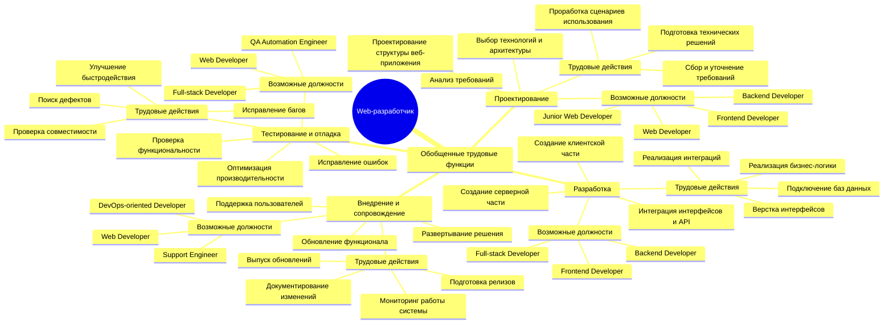
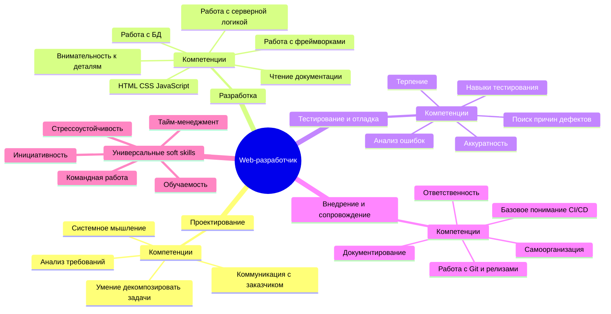

# Лабораторная работа 4

## Тема

Интеллект-карты по профессиональному стандарту "Разработчик Web и мультимедийных приложений".

Ниже даны две карты в формате `Mermaid`. Их можно:

- открыть прямо на GitHub;
- вставить в Markdown-отчет;
- перенести в XMind, draw.io, Miro или Canva.

## Карта 1. Профессия -> обобщенные трудовые функции -> трудовые функции -> должности -> трудовые действия

## Карта 2. Профессия -> обобщенные трудовые функции -> компетенции

## Краткий вывод

Профессиональный стандарт показывает, что web-разработчик — это не только исполнитель кода, но и специалист, участвующий в анализе требований, проектировании, тестировании, внедрении и сопровождении продукта. Поэтому для профессии важны как технические, так и коммуникативные, организационные и аналитические компетенции.
