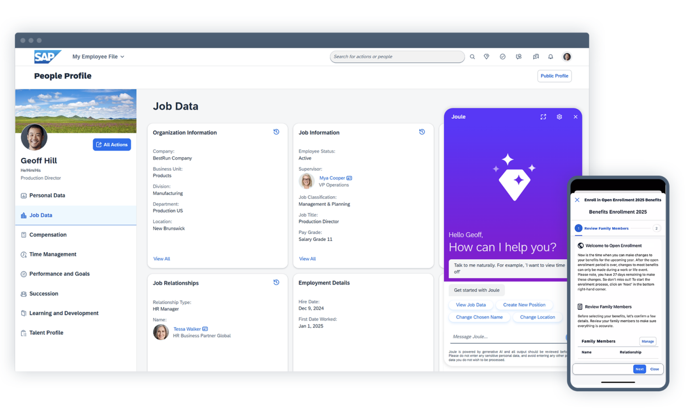
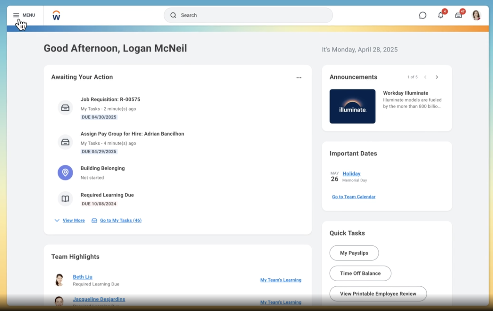
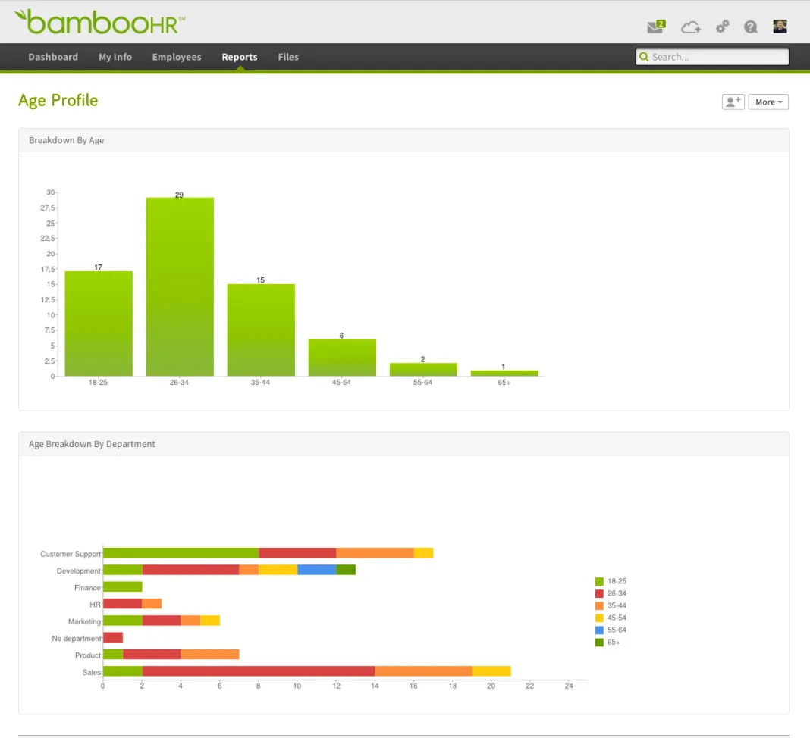
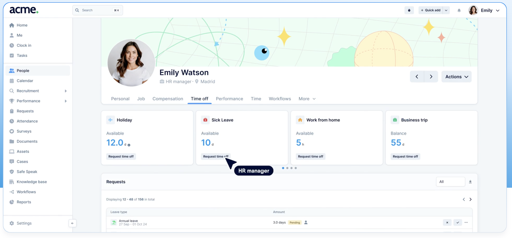
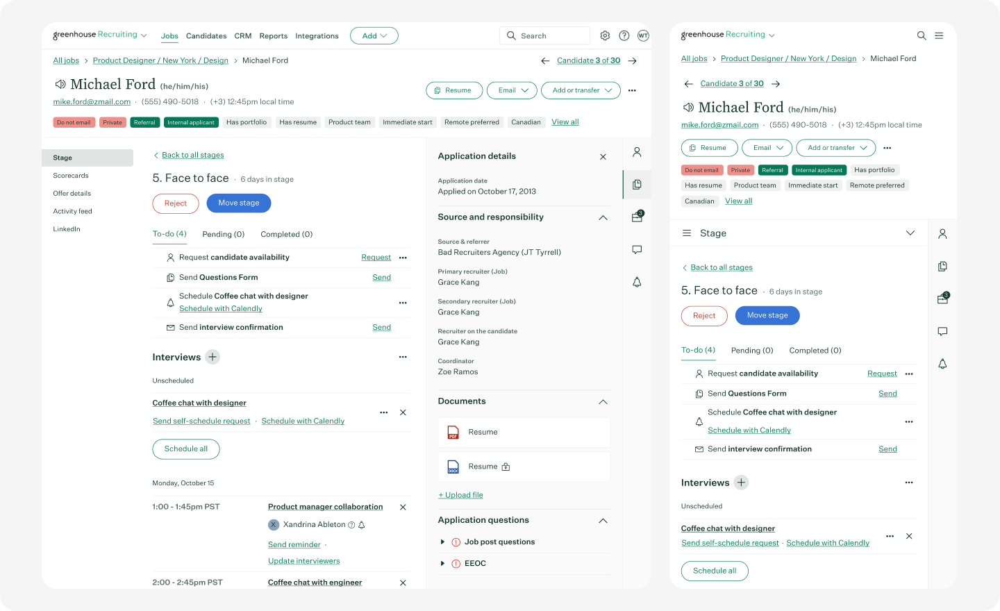
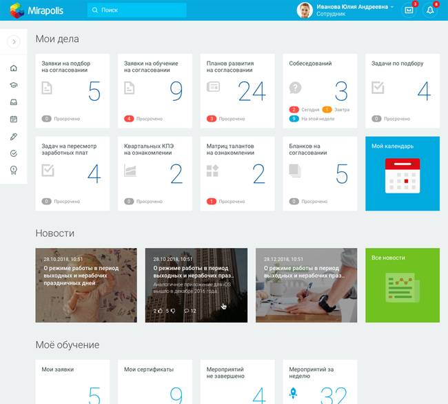
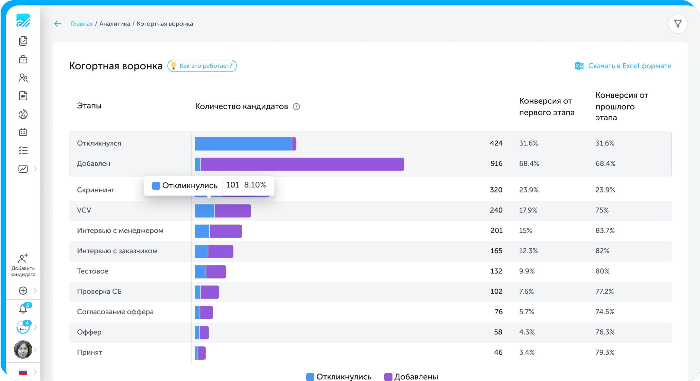
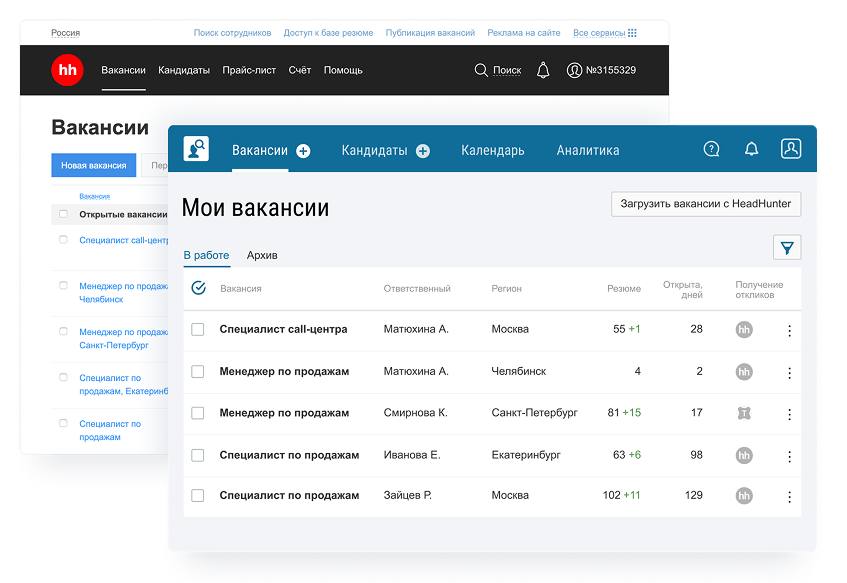
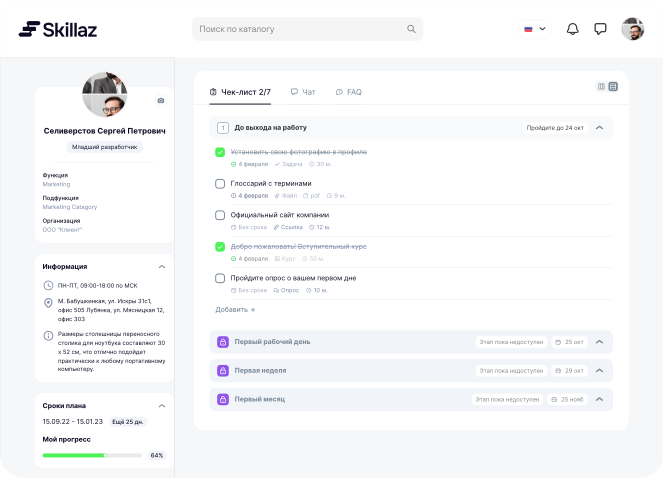

# Лабораторные работы 1-2

## Тема

Анализ зарубежного и отечественного рынка информационных систем для управления и оценки персонала.

## 1. Сравнительная таблица

| № | Система | Страна / сегмент | Формат | Основное назначение | Сильные стороны | Ограничения |
|---|---|---|---|---|---|---|
| 1 | SAP SuccessFactors | зарубежная | облачная | HCM, рекрутинг, performance, обучение | широкий корпоративный функционал, масштабируемость | сложность внедрения, высокая стоимость |
| 2 | Workday HCM | зарубежная | облачная | управление персоналом, аналитика, performance | сильная аналитика, удобство для крупных компаний | высокая стоимость, ориентированность на enterprise |
| 3 | BambooHR | зарубежная | облачная | HRIS для малого и среднего бизнеса | простой интерфейс, быстрый старт | меньше глубина в сложных enterprise-процессах |
| 4 | PeopleForce | зарубежная | облачная | HRM, ATS, performance, people analytics | единая платформа, удобный recruiting-модуль | часть функций зависит от тарифа |
| 5 | Greenhouse | зарубежная | облачная | ATS и рекрутинг | сильный подбор, удобные воронки и совместная оценка | узкая специализация, не покрывает весь HCM |
| 6 | Mirapolis HCM | российская | облачная / корпоративная | управление человеческим капиталом, подбор, оценка, обучение | сильное покрытие HR-процессов, российская локализация | сложнее для небольших компаний |
| 7 | Potok | российская | облачная | рекрутинг, адаптация, опросы, 360 | развитые HR-сервисы и локальная поддержка | часть продвинутых функций доступна по подписке |
| 8 | Talantix | российская | облачная | ATS, рекрутинг, база кандидатов | интеграция с hh.ru, понятный массовый подбор | фокус в первую очередь на подборе |
| 9 | Huntflow | российская | облачная | ATS и CRM для рекрутинга | удобный интерфейс, автоматизация найма, развитый сорсинг | меньше функций для оценки после найма |
| 10 | Skillaz | российская | облачная | подбор, автоматизация рекрутинга, массовый найм | сильная автоматизация и сценарии подбора | меньше универсальности как full HCM |

## 2. Краткие выводы по рынку

### Зарубежный рынок

Зарубежные решения чаще ориентированы на масштабные экосистемы HRM/HCM, где в единой платформе объединены рекрутинг, performance management, обучение, кадровое администрирование и аналитика. Их сильная сторона — зрелость процессов, интеграции и развитые аналитические инструменты. Слабая сторона — высокая стоимость, сложность внедрения и ограничения для российского рынка.

### Отечественный рынок

Российские решения заметно усилились в сегментах ATS, HCM, оценки и автоматизации HR-процессов. Их преимущества — локализация, лучшее соответствие российским бизнес-процессам, гибкость внедрения и отсутствие зависимости от зарубежных вендоров. Ограничения зависят от конкретного продукта: часть систем сильна в рекрутинге, но слабее в обучении, оценке или глубокой аналитике.

## 3. Итоговое сравнение по группам

| Критерий | Зарубежные решения | Российские решения |
|---|---|---|
| Масштаб HCM | очень высокий | от среднего до высокого |
| Локализация под РФ | ограниченная | высокая |
| Стоимость внедрения | чаще высокая | чаще более гибкая |
| Поддержка на русском рынке | ограниченная | сильная |
| Фокус на массовом найме | зависит от системы | часто развит хорошо |
| Импортонезависимость | низкая | высокая |

1. SAP SuccessFactors

 

2. Workday HCM

 

3. BambooHR

 

4. PeopleForce

 

5. Greenhouse

 

6. Mirapolis HCM

 

7. Potok

 

8. Talantix

 

9. Huntflow

 

10. Skillaz

 

## Вывод

Рынок ИТ-систем для управления и оценки персонала развивается в двух направлениях: комплексные enterprise-платформы и более узкие, но удобные специализированные сервисы. Для российских компаний особенно актуальны системы, которые сочетают локализацию, поддержку HR-процессов и приемлемую стоимость внедрения.
