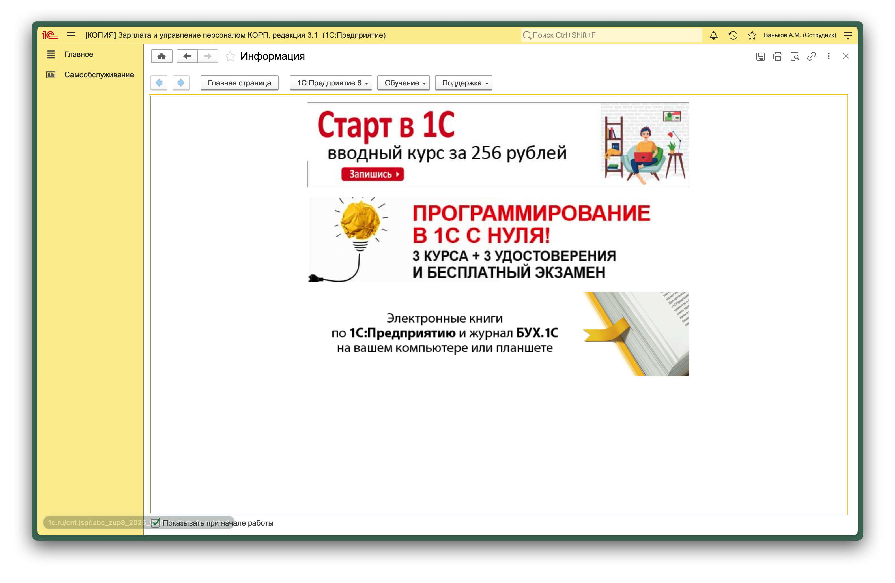
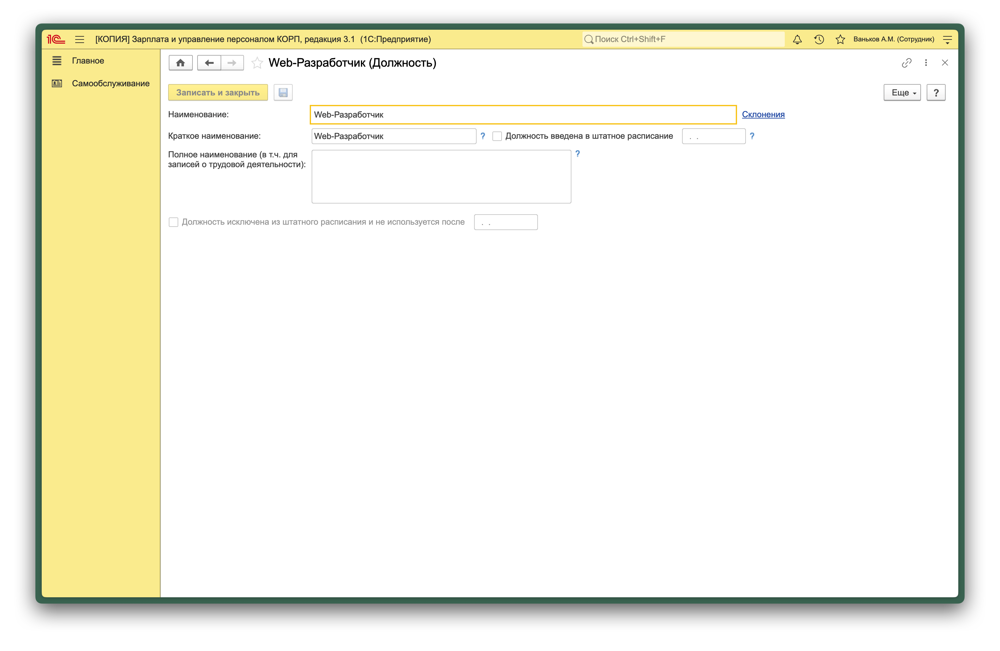
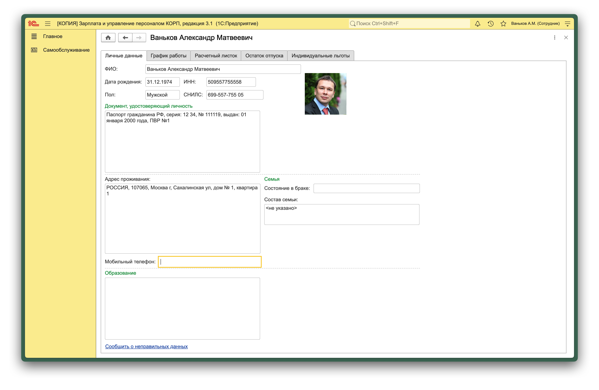
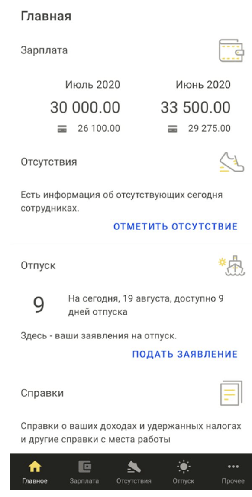
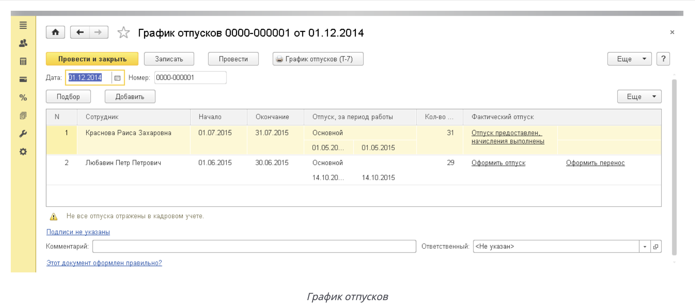
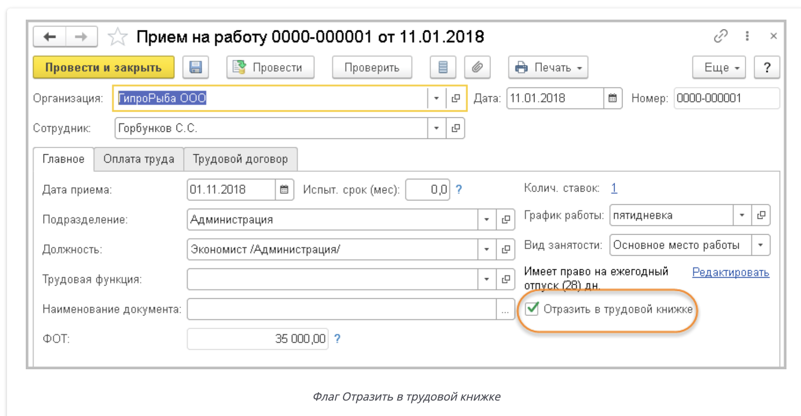

# Лабораторная работа 3-4

## Тема

Сравнение "1С: Зарплата и управление персоналом 8 ПРОФ" и "1С: Зарплата и управление персоналом 8 КОРП", создание профиля должности "Web-разработчик" в модуле подбора.

## 1. Сравнительная таблица 1С:ЗУП 8 ПРОФ и 1С:ЗУП 8 КОРП

| Критерий | 1С:ЗУП 8 ПРОФ | 1С:ЗУП 8 КОРП |
|---|---|---|
| Рекомендованный тип компаний | малый и средний бизнес | средний и крупный бизнес, компании со сложными HR-процессами |
| Цена (относительно версии) | ниже, базовый функционал | выше, расширенный функционал |
| Кадровый учет и расчет зарплаты | полный базовый контур | полный контур + расширенные HR-возможности |
| Подбор персонала | базовые сценарии подбора | расширенные сценарии подбора и профилирования |
| Оценка и развитие сотрудников | ограниченно | профили должностей, оценка, кадровый резерв, развитие |
| Организационное моделирование | базовый уровень | расширенный уровень |
| HR-аналитика | базовая | расширенная |
| Поддержка сложных HR-процессов | ограниченная | высокая |

## 2. Краткий аналитический вывод

Версия ПРОФ подходит организациям, где приоритетом являются кадровый учет и расчет заработной платы. Версия КОРП ориентирована на зрелые HR-процессы: подбор, оценку, развитие и управленческую аналитику. Для дисциплины по оценке персонала версия КОРП является более релевантной, поскольку позволяет формализовать компетентностные профили и применять расширенные инструменты подбора.

## 3. Профиль должности "Web-разработчик" (на базе профстандарта)

### 3.1. Наименование и цель

- Должность: `Web-разработчик`
- Подразделение: отдел разработки цифровых решений
- Цель: разработка, внедрение и сопровождение веб- и мультимедийных приложений на всех этапах жизненного цикла.

### 3.2. Основные трудовые функции

- анализ и уточнение требований к веб-приложению;
- проектирование структуры и логики веб-приложения;
- разработка клиентской части (интерфейсы, формы, навигация);
- разработка и интеграция серверной логики и API;
- тестирование, отладка, устранение дефектов;
- документирование решений и сопровождение релизов.

### 3.3. Требования к кандидату

- профильная IT-подготовка (высшее образование или обучение по ИТ-направлению);
- владение HTML, CSS, JavaScript;
- понимание клиент-серверной архитектуры и HTTP;
- навыки работы с системами контроля версий (Git);
- опыт интеграции REST API;
- понимание принципов хранения и обработки данных.

### 3.4. Необходимые знания и умения

- разрабатывать и модифицировать программный код веб-приложений;
- применять средства тестирования и отладки;
- анализировать технические требования и декомпозировать задачи;
- обеспечивать совместимость, производительность и удобство интерфейсов;
- взаимодействовать с аналитиками, дизайнерами и тестировщиками.

### 3.5. Личностные качества

- ответственность;
- внимательность к деталям;
- системное мышление;
- обучаемость;
- коммуникабельность и командная работа.

### 3.6. Условия работы

- формат: гибридный/удаленный;
- работа в кросс-функциональной проектной команде;
- гибкий график при соблюдении сроков задач;
- внутреннее наставничество и профессиональное развитие.

<!-- - [ ] Раздел `Подбор персонала`. -->
<!-- - [ ] Карточка созданного профиля `Web-разработчик`.
- [ ] Блок обязанностей в профиле.
- [ ] Блок требований/умений в профиле. -->

