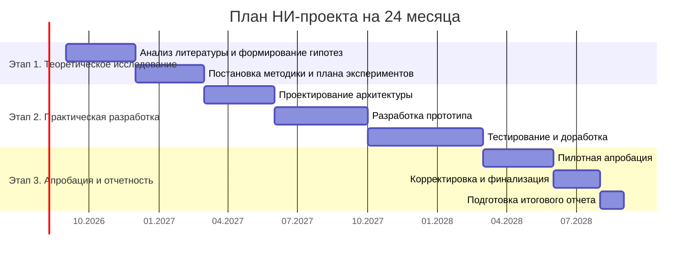

# Задание 7.1. План работы руководителя по выполнению НИ проекта

## Исходные условия

- общая длительность проекта: 2 года (24 месяца);
- этап 1: теоретическое исследование (6 месяцев);
- этап 2: практическая разработка (12 месяцев);
- этап 3: апробация и итоговый отчет (6 месяцев);
- промежуточные отчеты: каждые 6 месяцев.

## 1) План работы руководителя

### Вехи и отчетность

| Период | Контрольная точка | Результат |
|---|---|---|
| Месяц 6 | Промежуточный отчет №1 | Теоретическая база, гипотезы, методика |
| Месяц 12 | Промежуточный отчет №2 | Архитектура и базовый прототип |
| Месяц 18 | Промежуточный отчет №3 | Рабочая версия и результаты тестирования |
| Месяц 24 | Итоговый отчет | Результаты апробации и финальный продукт |

## 2) Предлагаемый состав группы

1. Руководитель НИР / научный консультант.
2. Аналитик-исследователь (методология, дизайн исследования).
3. Data Scientist / ML-инженер.
4. Backend-разработчик.
5. QA/тестировщик и специалист по апробации.
6. Эксперт предметной области (HR/бизнес-процессы).

## 3) Организация контроля выполнения работ

1. Еженедельные короткие статусы команды (30-40 минут).
2. Ежемесячный контроль выполнения дорожной карты по метрикам сроков и качества.
3. Квартальная экспертная сессия с научным руководителем.
4. Полугодовая подготовка формализованного отчета по результатам этапа.
5. Ведение риск-реестра и корректирующих действий.

### Базовые KPI контроля

- соблюдение сроков этапов (`>= 90%` задач в срок);
- выполнение критериев качества прототипа;
- полнота экспериментальных данных;
- достижение целевых метрик продукта на апробации.

## Дополнение: матрица ответственности (RACI)

| Направление работ | Руководитель НИР | Аналитик | ML-инженер | Backend | QA/апробация | HR-эксперт |
|---|---|---|---|---|---|---|
| Формирование целей и плана | A/R | C | I | I | I | C |
| Методика исследования | A | R | C | I | C | C |
| Разработка модели | C | C | A/R | C | I | C |
| Разработка сервиса | I | C | C | A/R | C | I |
| Тестирование и апробация | C | C | C | C | A/R | C |
| Подготовка отчетов | A/R | R | C | C | C | I |

`A` — accountable, `R` — responsible, `C` — consulted, `I` — informed.

## Дополнение: регламент управления рисками

1. Ежемесячный пересмотр риск-реестра.
2. Назначение владельца на каждый критичный риск.
3. Формирование плана реакции: предотвращение, снижение, перенос, принятие.
4. Фиксация инцидентов и корректирующих мер в журнале проекта.

## Итог

Предложенная система планирования и контроля обеспечивает управляемость двухлетнего НИ-проекта, прозрачность ответственности и предсказуемость промежуточных результатов.

