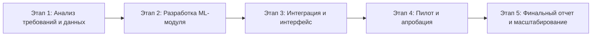

# Задание 7.2. Итоговое сквозное задание: заявка на конкурс

## 1. Наименование проекта

**SmartHire AI** — интеллектуальная система поддержки решений для ИТ-рекрутмента и формирования short-list кандидатов.

## 2. Краткое описание проекта

Проект направлен на создание научно-технического продукта, который автоматизирует предварительный анализ резюме и вакансий, ранжирует кандидатов по степени соответствия требованиям и формирует объяснимые рекомендации для рекрутера и технического интервьюера.

## 3. Научно-техническая новизна

1. Гибридная модель сопоставления: семантический анализ текста + структурные признаки компетенций.
2. Механизм объяснимого ранжирования (пояснение, какие требования закрывает кандидат).
3. Адаптивная подстройка весов компетенций под тип ИТ-позиции.

## 4. Актуальность и проблема

Текущий процесс первичного отбора в ИТ-рекрутменте требует значительных трудозатрат и подвержен субъективности. Для компаний это означает рост времени закрытия вакансий и потери из-за некорректного первичного фильтра.

## 5. Цель и задачи проекта

**Цель:** разработать и апробировать систему интеллектуального ранжирования кандидатов для ускорения и повышения качества ИТ-подбора.

**Задачи:**

1. Сформировать датасет вакансий и резюме (обезличенный).
2. Разработать модель извлечения компетенций и сопоставления профилей.
3. Реализовать модуль ранжирования и интерфейс рекомендаций.
4. Провести пилотную апробацию в сценарии реального подбора.
5. Подготовить методику оценки эффективности.

## 6. Описание научно-технического продукта

### Функциональные модули

- загрузка и нормализация данных вакансий/резюме;
- NLP-анализ и выделение ключевых навыков;
- скоринг и ранжирование кандидатов;
- объяснение результатов (reasoning блок);
- аналитическая панель HR-метрик.

### Технологический стек (проектный)

- backend: `Python` / `FastAPI`;
- data: `PostgreSQL`;
- ML/NLP: `transformer`-модели + классические методы;
- UI: web-интерфейс для рекрутера.

## 7. Дорожная карта реализации

## 8. План-график (24 месяца)

| Период | Работы | Результат |
|---|---|---|
| 1-6 мес. | Исследование, проектирование, методика | ТЗ, архитектура, протокол экспериментов |
| 7-12 мес. | Разработка ядра системы | MVP с базовым ранжированием |
| 13-18 мес. | Расширение функционала и тестирование | Версия для пилотной эксплуатации |
| 19-24 мес. | Апробация, корректировка, отчет | Подтвержденный эффект и итоговая документация |

## 9. Команда проекта

1. Руководитель проекта (координация, сроки, качество).
2. Исследователь-аналитик (методология, экспериментальный дизайн).
3. ML-инженер (алгоритмы извлечения компетенций и ранжирование).
4. Backend-разработчик (API, интеграция, хранение данных).
5. HR-эксперт/продуктовый аналитик (валидация бизнес-ценности).

## 10. Оценка рынка и потребителей

- сегмент: HRTech для ИТ-рынка (`B2B`);
- клиенты: ИТ-компании, рекрутинговые агентства, крупные внутренние HR-службы;
- эффект для клиента: сокращение времени первичного отбора, повышение точности short-list, снижение операционных затрат.

## 11. Конкурентные преимущества

1. Специализация на ИТ-вакансиях и технических компетенциях.
2. Прозрачный объяснимый скоринг вместо "черного ящика".
3. Быстрая интеграция в процесс рекрутинга без радикальной перестройки HR-контура.

## 12. Оценка рисков и меры снижения

| Риск | Вероятность/влияние | Митигирующие меры |
|---|---|---|
| Недостаток качественных данных | Средняя/Высокое | Анонимизация и расширение пула источников, контроль качества разметки |
| Смещение модели | Средняя/Среднее | Регулярная переоценка метрик, human-in-the-loop |
| Слабая приемка пользователями | Средняя/Высокое | UX-тесты и пилоты с рекрутерами с ранних этапов |
| Правовые ограничения по данным | Низкая/Высокое | Политика доступа, журналирование, соответствие локальным требованиям |

## 13. Ожидаемые результаты и KPI

1. Сокращение времени первичного отбора резюме на 30-40%.
2. Рост релевантности short-list (по метрикам качества) не менее чем на 20%.
3. Подготовка комплекта НИ-документации и внедренческого отчета.

## 14. Бюджет проекта (укрупненно)

| Статья затрат | Доля |
|---|---|
| Фонд оплаты труда команды | 65% |
| Вычислительная инфраструктура и ПО | 15% |
| Апробация и пилотные внедрения | 10% |
| Административные и организационные расходы | 10% |

## 15. Итоговое обоснование для конкурса

Проект отвечает приоритету цифровизации и развитию отечественных прикладных ИИ-решений. Продукт имеет научную новизну, прикладную востребованность и масштабируемую модель внедрения в российский HRTech-сегмент.

## 16. План коммерциализации

1. Пилот с 1-2 технологическими компаниями (3-4 месяца).
2. Подготовка отраслевого пакетного предложения для B2B.
3. Подключение партнерского канала (HR-агентства/интеграторы).
4. Масштабирование в смежные сегменты подбора персонала.

## 17. Стратегия масштабирования

| Этап | Горизонт | Результат |
|---|---|---|
| Pilot | 0-6 месяцев | Подтверждение ценности и стабильности решения |
| Early scale | 6-12 месяцев | Подключение 5-10 корпоративных клиентов |
| Growth | 12-24 месяца | Выход на повторяемые продажи и устойчивую экономику |

## 18. Интеллектуальная собственность и правовая защита

1. Регистрация программного продукта и документирование алгоритмов.
2. Договорной контур по правам на данные и результаты дообучения.
3. Политика информационной безопасности и разграничение доступа.
4. Соответствие требованиям локального законодательства о персональных данных.

## 19. Социальный и образовательный эффект

- сокращение времени найма и нагрузки на HR-команды;
- повышение качества подбора в ИТ-компаниях;
- возможность интеграции в образовательные треки по карьерной навигации;
- формирование практической базы для научных публикаций и ВКР.

## 20. Вывод по сквозной заявке

Проект сочетает исследовательскую новизну и прикладную ценность, соответствует тематике цифровой экономики и имеет реалистичную траекторию от НИР до коммерческого продукта.

