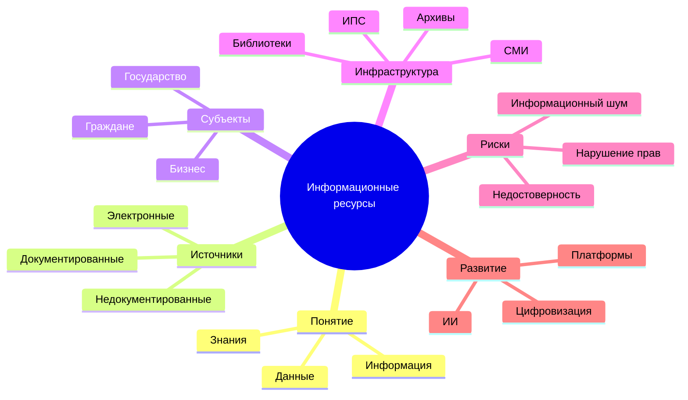

# Ментальная карта лекции 1

## Тема

Основные понятия информационных ресурсов и их роль в современном обществе.

## Ментальная карта (текстовый формат)

## Вывод

Информационные ресурсы являются стратегическим активом. Их качество, доступность и правовой режим напрямую влияют на образование, науку, экономику и государственное управление.

