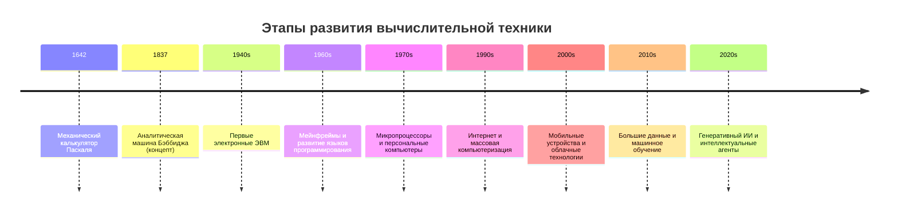

# ВСР 10. Лента времени развития вычислительной техники

## Задание 10.1: этапы развития вычислительной техники

## Задание 10.2: ученые и изобретатели

| Личность | Период | Вклад |
|---|---|---|
| Блез Паскаль | XVII век | Ранние вычислительные устройства |
| Чарльз Бэббидж | XIX век | Концепция программируемой машины |
| Ада Лавлейс | XIX век | Первые идеи программирования |
| Алан Тьюринг | XX век | Теория вычислений и основы ИИ |
| Джон фон Нейман | XX век | Архитектура ЭВМ |
| Норберт Винер | XX век | Кибернетика |
| Тим Бернерс-Ли | XX-XXI вв. | WWW и веб-стандарты |

## Вывод

Лента времени показывает переход от механических вычислений к интеллектуальным системам и подчеркивает вклад ключевых ученых в развитие информатики.

