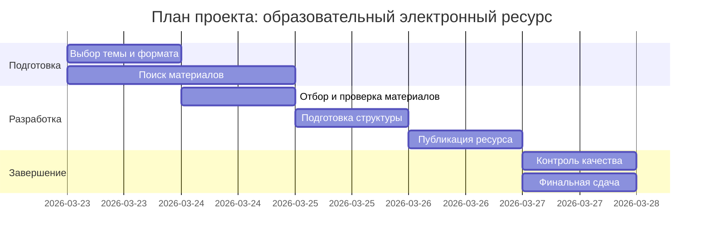

# ИСР 10. Планирование проекта

## Тема проекта

`Разработка образовательного электронного ресурса`

## Цель проекта

Подготовить и опубликовать образовательный электронный ресурс, включающий отбор материалов, редакционную подготовку, публикацию и контроль качества результата.

## Состав рабочей группы

| Участник | Роль | Основная зона ответственности |
|---|---|---|
| Участник 1 | Координатор проекта | планирование, контроль сроков, коммуникация |
| Участник 2 | Контент-редактор | поиск материалов, отбор источников, структура содержания |
| Участник 3 | Технический исполнитель | подготовка ресурса к публикации, оформление, загрузка |
| Участник 4 | Контролер качества | проверка корректности материалов, финальный аудит, тестирование |

## Этапы работы

| Этап | Содержание | Ответственный | Срок |
|---|---|---|---|
| 1 | Определение темы и формата ресурса | Координатор + вся группа | День 1 |
| 2 | Поиск материалов и источников | Контент-редактор | День 1-2 |
| 3 | Отбор и проверка материалов | Контент-редактор + Контролер качества | День 2 |
| 4 | Подготовка структуры ресурса | Координатор + Технический исполнитель | День 3 |
| 5 | Техническое оформление и публикация | Технический исполнитель | День 4 |
| 6 | Проверка качества и исправления | Контролер качества + вся группа | День 5 |
| 7 | Финальная сдача и отчет | Координатор | День 5 |

## Задачи по участникам

### Координатор проекта

- формирует общий план;
- распределяет задачи;
- следит за соблюдением сроков;
- собирает итоговый результат.

### Контент-редактор

- подбирает материалы;
- проверяет актуальность и надежность источников;
- подготавливает текстовое содержание.

### Технический исполнитель

- оформляет материал;
- публикует ресурс;
- проверяет работоспособность структуры и отображения.

### Контролер качества

- проверяет полноту;
- следит за корректностью ссылок, формулировок и оформления;
- фиксирует замечания перед финальной сдачей.

## Контроль выполнения

Контроль организуется по ежедневным контрольным точкам:

1. В конце первого дня утверждается тема и список источников.
2. В конце второго дня утверждается отобранный материал.
3. В конце третьего дня проверяется структура ресурса.
4. В конце четвертого дня проверяется опубликованный черновой вариант.
5. В конце пятого дня сдается итоговый результат.

## Mermaid-план

## Вывод

Эффективное планирование проекта требует четкого распределения ролей, понятных сроков и постоянного контроля промежуточных результатов. Даже небольшой образовательный ресурс удобнее создавать как полноценный проект с этапами, ответственными и проверкой качества.
