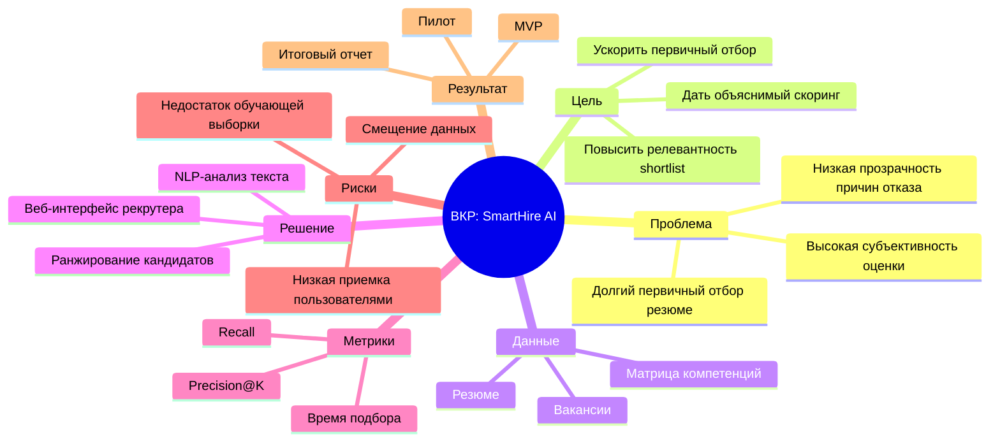

# ВСР 9. Интеллект-карта решения проектной задачи (тема ВКР)

## Формулировка задачи

Построить интеллект-карту решения проектной задачи по теме ВКР:  
`Интеллектуальная система поддержки ИТ-рекрутмента`.

## Интеллект-карта (текстовый формат)

## Ответы на вопросы задания

1. **В чем проблема?** Длительный и субъективный первичный отбор.
2. **Почему это проблема?** Потери времени, риски ошибочного найма, перегрузка HR.
3. **Почему важно решить?** Повышается эффективность подбора и качество решений.
4. **Какой идеальный результат?** Быстрый прозрачный shortlist кандидатов.
5. **Что даст в перспективе?** Масштабируемый HRTech-продукт и практическая ценность для ВКР.
6. **Что можно сделать?** Последовательно пройти этапы: данные -> модель -> интерфейс -> пилот.

