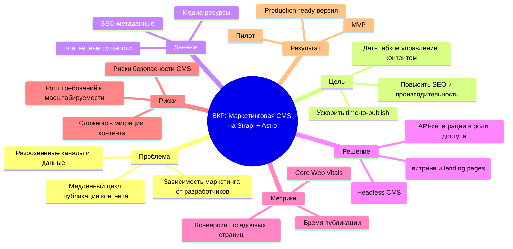

# ВСР 9. Интеллект-карта решения проектной задачи (тема ВКР)

## Формулировка задачи

Построить интеллект-карту решения проектной задачи по теме ВКР:  
`Разработка системы управления контентом в сфере маркетинга на базе Strapi и Astro`.

## Интеллект-карта (текстовый формат)

## Ответы на вопросы задания

1. **В чем проблема?** Публикация маркетингового контента занимает много времени и часто требует участия разработчика даже в типовых задачах.
2. **Почему это проблема?** Теряется скорость маркетинговых гипотез, ухудшается time-to-market и управляемость контент-кампаний.
3. **Почему важно решить?** Гибкая CMS напрямую влияет на эффективность digital-маркетинга, SEO-видимость и бизнес-результат.
4. **Какой идеальный результат?** Маркетинг-команда самостоятельно управляет контентом, а фронтенд на Astro быстро и стабильно отображает его пользователям.
5. **Что даст в перспективе?** Масштабируемая платформа для контентных продуктов и подтвержденный fullstack/архитектурный кейс в портфолио.
6. **Что можно сделать?** Этапы: проектирование домена -> настройка Strapi -> разработка Astro-витрины -> интеграции -> тестирование -> пилот и метрики.

