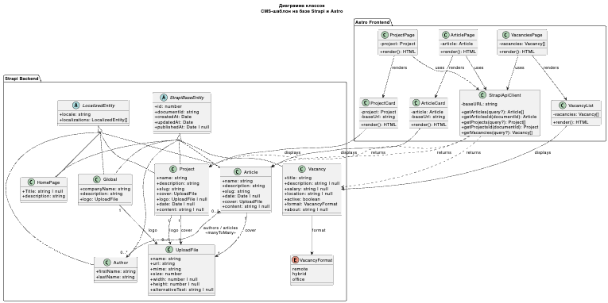

# Система управления контентом для маркетингового сайта
## ВКР: Strapi + Astro

- Open-source шаблон для быстрого запуска маркетингового сайта
- `Strapi` используется как headless CMS и источник API
- `Astro` генерирует статические страницы для высокой скорости и SEO

---

# Как работает решение

**Strapi**

- Admin UI для управления контентом и ролями
- content types: `Article`, `Project`, `Vacancy`, `Author`
- REST API и OpenAPI-документация

**Astro**

- на этапе `astro build` забирает только опубликованные данные
- собирает готовые HTML-страницы
- посетитель читает сайт без обращений к CMS во время просмотра

`Strapi -> API -> Astro build -> static pages -> visitor`

---

# Что показывает UML-модель проекта

- роли пользователей и ключевые сценарии работы
- структуру сущностей и связи между CMS и фронтендом
- публикацию контента, статическую сборку и жизненный цикл материалов

